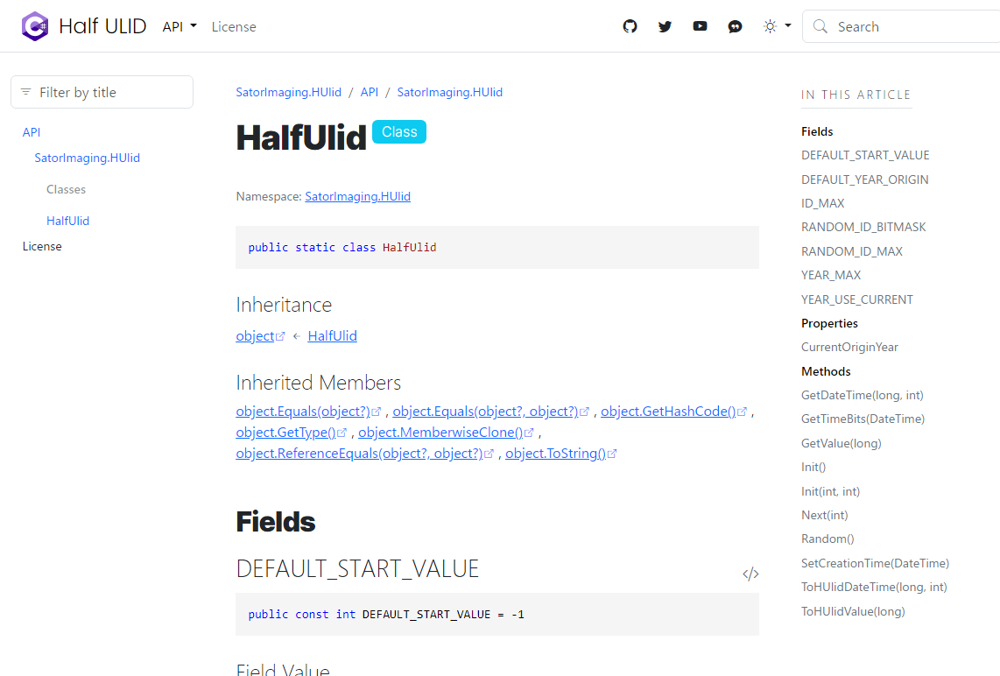
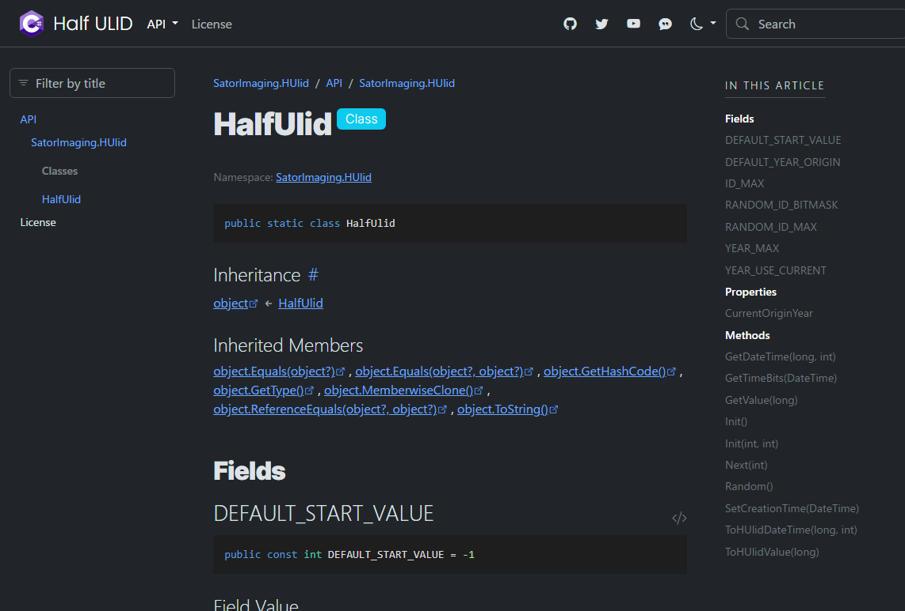
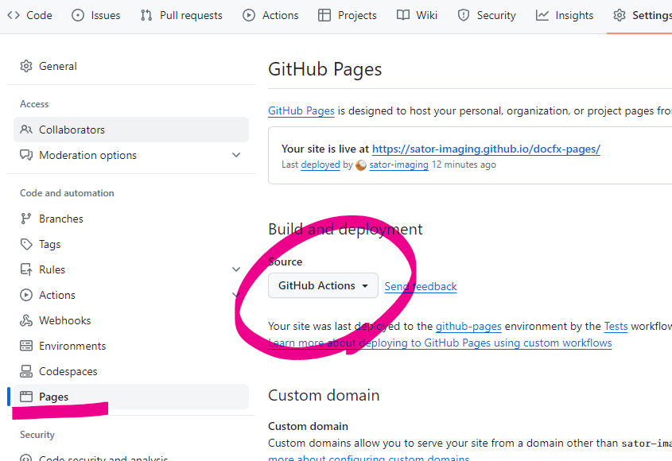

# `docfx` for GitHub Pages

Deploy beautiful API reference to GitHub Pages with only 1 action. No unnecessary file upload and complicated `docfx` setup.

| Light Theme | Dark Theme |
|:-----------:|:----------:|
|   | 


## Usage

```yaml
- uses: sator-imaging/docfx-pages@v1
  id: deployment   # required to show url in actions result page.
  with:
    # required parameters
    app_name:    'docfx-pages'
    site_title:  'Deploy using sator-imaging/docfx-pages'
    site_footer: '<em>HTML tags accepted</em>'
    # optional parameters
    class_members: ...
```


### Sample Outputs

- Built with `class_members: 'separatePages'` → [Go 🧾](https://sator-imaging.github.io/Half-Ulid/api/SatorImaging.HUlid.html)
- Built with `class_members: 'samePage'` → [Go 🧾](https://sator-imaging.github.io/docfx-pages/api/SatorImaging.DocFXPages.Tests.App.html)
  - *Note:* this sample demonstrates wrong result when specify `site_logo` or `site_favidon` as full-qualified URL. (Logo image in header is missing. `docfx` supports only relative path.)


## Getting Started

Just enable GitHub Pages in repository setting and paste the code below.



<p><details lang="en" open><summary>GitHub Actions source code</summary>

```yaml
name: docfx for GitHub Pages

on:
  # Runs on pushes targeting the default branch
  push:
    branches:
      - 'main'
      ##- 'releases/**'
  pull_request:
    branches: 
      - 'main'
  release:
    types: [published]

  # Allows you to run this workflow manually from the Actions tab
  workflow_dispatch:

# Sets permissions of the GITHUB_TOKEN to allow deployment to GitHub Pages
permissions:
  contents: read
  pages: write
  id-token: write

# Allow only one concurrent deployment, skipping runs queued between the run in-progress and latest queued.
# However, do NOT cancel in-progress runs as we want to allow these production deployments to complete.
concurrency:
  group: "pages"
  cancel-in-progress: false

jobs:
  # Single deploy job since we're just deploying
  deploy:
    environment:
      name: github-pages
      url: ${{ steps.deployment.outputs.page_url }}
    runs-on: ubuntu-latest


    #########################################
    ######  sator-imaging/docfx-pages  ######
    #########################################
    steps:

      # for extensibility, docfx-pages does NOT checkout your repository.
      # so you need to checkout manually prior to sator-imaging/docfx-pages.
      - name: Checkout
        uses: actions/checkout@v3


      # after checkout, you can checkout another repo, copy logo image or
      # other assets into '.docfx' folder to setup own docfx environment.
      # note that images must be copied into '.docfx/images' folder.


      ######  main  ######

      - uses: sator-imaging/docfx-pages@v1
        id: deployment   # required to show url in actions result page.
        with:

          # required options
          # NOTE: double-quote (") cannot be used, backquote (`) must be escaped (\`).
          app_name:    'Deploy Test'
          site_title:  'Deploy Test using sator-imaging/docfx-pages'
          site_footer: '<big>&times; Is HTML accepted?</big>'

          # optional
          class_members:    'separatePages'  # 'separatePages' or 'samePage'
          google_analytics: ''               # empty to disable

          # paths must be relative from .docfx folder.
          # note that url works but only in top page. see sample website for detail.
          site_logo:    '<logo>.svg'
          site_favicon: '<favicon>.svg'

          # advanced options
          # --> https://dotnet.github.io/docfx/docs/template.html?tabs=modern#custom-template
          # main.js
          # NOTE: double-quote (") cannot be used, backquote (`) must be escaped (\`).
          main_js: |
            export default {
                defaultTheme: 'light',
                showLightbox: (img) => true,
                iconLinks: [
                    {
                        icon: 'github',
                        href: 'https://github.com/sator-imaging',
                        title: 'GitHub'
                    },
                ],
            }

          # main.css
          # NOTE: double-quote (") cannot be used, backquote (`) must be escaped (\`).
          main_css: |

```

<!------- End of Details EN Tag -------></details></p>


## Builtin Assets

- `images/wikimedia-commons/logo-csharp-recolor.svg`
    - C# logo file for `site_logo` and `site_favicon`
    - 
- `images/unity/made-with-unity.svg`
    - Theme-aware SVG file for `site_logo`
    - 


## Advanced Usage

Full customize can be done by adding `.docfx` folder to **your repository**.

For example, add logo image to `.docfx/images` folder in your repository.

- `.docfx/images/<your-logo>.svg`
- `.docfx/images/<your-favicon>.svg` or `.ico`

then, set options in your GitHub Actions. Note that paths must be relative from `.docfx` folder.

```yaml
- uses: sator-imaging/docfx-pages@v1
  with:
    site_logo:    'images/<your-logo>.svg'
    site_favicon: 'images/<your-favicon>.ico'
```

> [!NOTE]
> You can prepare `.docfx` contents in your GitHub Actions instead of duplicating/uploading files in repository.


## Technical Notes

- `toc.yml` is automatically generated.
- `README` or `README.md` is generated when doesn't exist.
- `README.md` is used as fallback for `index.md`.
- `LICENSE` or `LICENSE.md` document title is automatically set. (insert `#` at the beginning of first line)


## Devnote

### TODO

- add `docfx_metadata`, `docfx_build` and `docfx_filter` options for easy customization.
    - currently, it can be achieved by adding `.docfx` folder and place files correctly.
